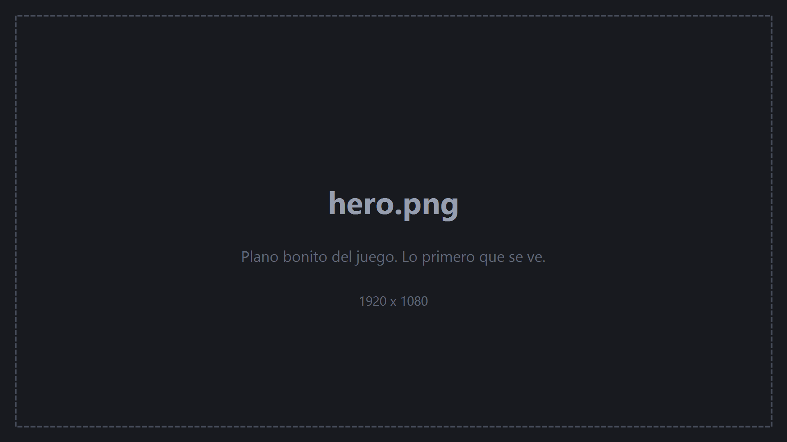
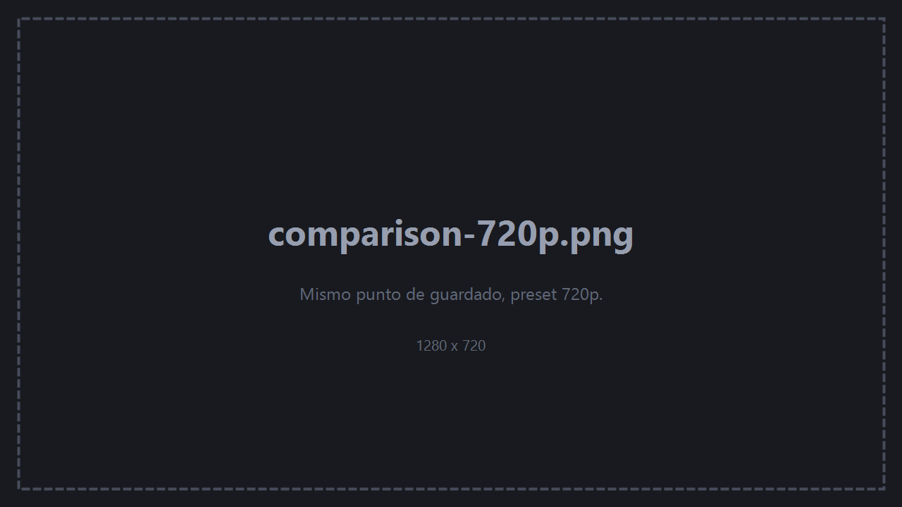
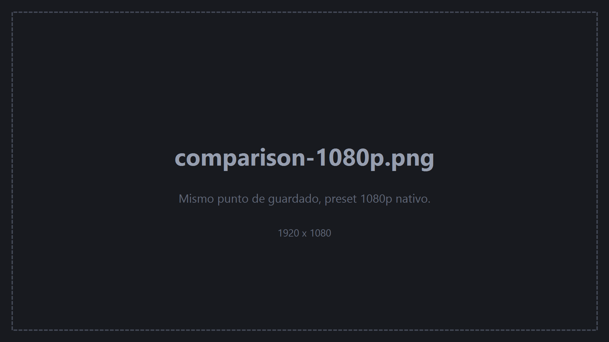
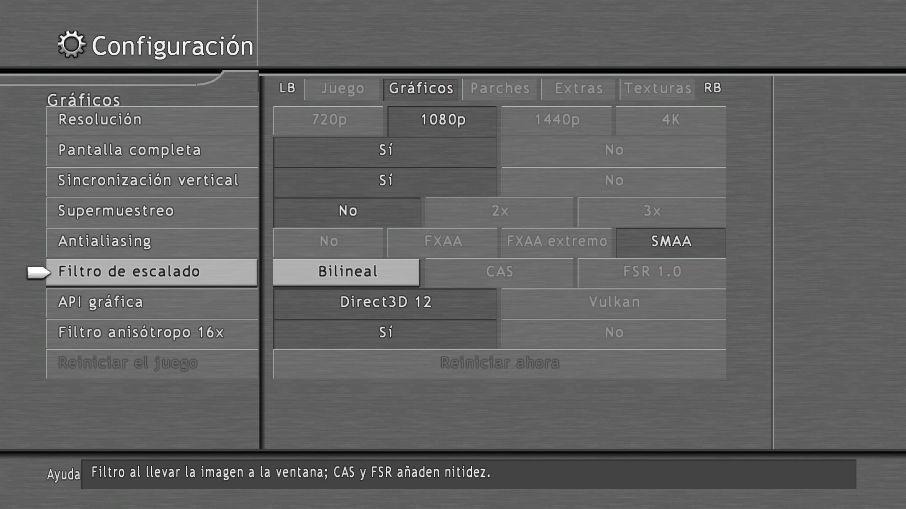
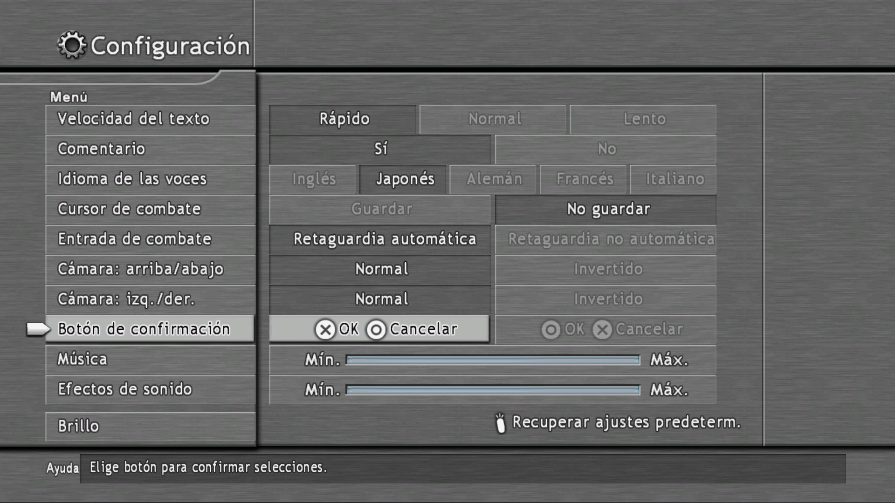
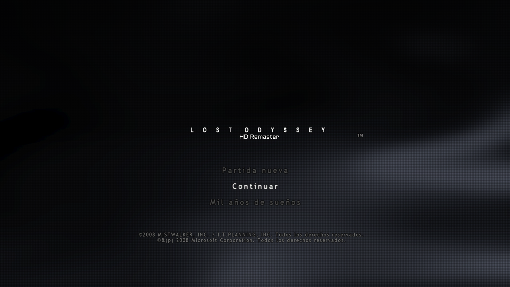
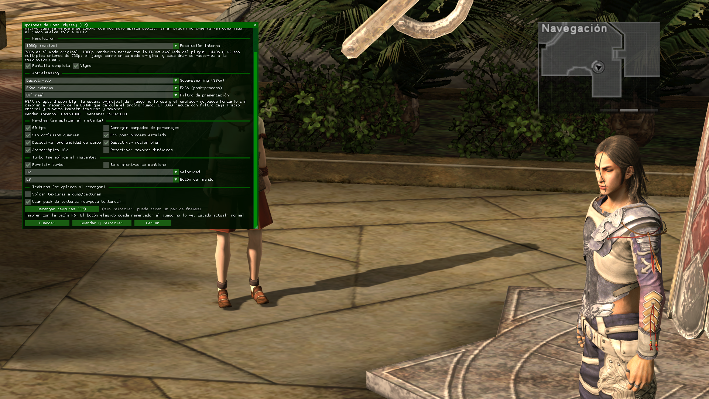

# Lost Odyssey — Port a PC

**Una versión nativa de PC de Lost Odyssey (Xbox 360), obtenida por recompilación estática del código original del juego. No es un emulador.**

*[Read this in English](README.md)*



> **Estado:** en desarrollo · jugable · código aún no publicado · sin descargas
> Este repositorio es una ventana al progreso, no una release. Ver las [preguntas frecuentes](docs/faq.md).

---

## Qué es esto

Lost Odyssey salió en 2007 para Xbox 360 y nunca llegó a PC. Este proyecto lo convierte en un ejecutable de PC de verdad.

La recompilación estática traduce el código máquina PowerPC original del juego, función a función, a código fuente x86-64, que después se compila como un binario normal de Windows. No hay emulación de CPU en tiempo de ejecución, ni intérprete, ni JIT: la lógica del juego corre como código nativo en tu procesador. Solo se reimplementa en el anfitrión lo que el juego le pedía a la consola: el flujo de comandos de GPU, el sistema de ficheros, las partidas guardadas, el audio y el mando.

La diferencia práctica es que el juego deja de comportarse como un juego de consola bajo emulación y empieza a comportarse como un juego de PC. Se puede modificar. Se le puede cambiar el renderizador. Su resolución ya no la decide lo que cabía en la memoria de una GPU de 2007.

Construido sobre el SDK de recompilación [ReXGlue](https://github.com/rexglue/rexglue-sdk) (0.10.0), con un fork muy modificado de su plugin de GPU Xenos.

---

## Estado actual

| | |
|---|---|
| **Arranca y se juega** | Sí — menú, partidas guardadas, logros, cinemáticas |
| **Renderizadores** | Direct3D 12 y Vulkan, los dos en un plugin, elegibles desde el juego |
| **1080p nativo** | Funcionando en los dos |
| **1440p / 4K** | Funcionando en los dos |
| **SMAA** | Funcionando en los dos |
| **Pack de texturas** | Funcionando en los dos |
| **Ajustes en el menú del propio juego** | Funcionando |
| **Los cuatro discos** | Cambio de disco automático — carpetas extraídas, ISO o Games on Demand |
| **Linux** | Aún no compilado — el SDK lo soporta, incluido arm64 |
| **Android** | El SDK no lo soporta |

Con honestidad: «jugable» significa que arranca, corre, guarda y aguanta sesiones largas. El cambio de disco se ha probado forzándolo, todavía no en un cambio de capítulo real, y el juego no se ha verificado de principio a fin en los cuatro discos.

---

## Qué añade sobre la versión de Xbox 360

### 1080p real, no reescalado

La 360 renderiza Lost Odyssey a 1280×720 porque es lo que cabe en los 10 MB de EDRAM de la consola, contando color y profundidad a la vez. Lo interesante de este proyecto es que ahora el juego renderiza un fotograma 1920×1080 auténtico, HUD y menús incluidos, en vez de un fotograma 720p estirado hasta tu monitor.

Llegar ahí exigió multiplicar por ocho la EDRAM emulada, ampliar los campos de dirección de los render targets, parchear en binario los shaders de resolve precompilados del plugin y reescribir la proyección 2D del juego dibujada a dibujada para que la interfaz siga al lienzo grande. [Cómo funciona →](docs/technical.md)

Opciones de resolución:

| Preset | Render interno | Notas |
|---|---|---|
| 720p | 1280×720 | Modo original de consola |
| **1080p (nativo)** | 1920×1080 | El juego renderiza 1080p de verdad |
| 1440p | 2560×1440 | Supermuestreo ×2 del lienzo 720p |
| 4K | 3840×2160 | Supermuestreo ×3 del lienzo 720p |

Sobre el preset: SSAA ×1/×2/×3, antialiasing de post-proceso (FXAA, FXAA extremo o SMAA 1x) y filtro de presentación (bilineal, CAS o FSR).

### SMAA

Subpixel Morphological Antialiasing —la implementación de referencia, sin modificar— en tres pasadas de compute sobre el fotograma final, en los dos renderizadores. Bordes más limpios que con FXAA, sin el emborronado general que deja FXAA. [Cómo encaja →](docs/technical.md#5-smaa-on-the-final-frame)

TAA se estudió y se ha dejado fuera a propósito por ahora: hecho bien necesita jitter de cámara por shader, la escena antes del HUD, profundidad, historial y vectores de movimiento.

### Ajustes dentro del menú del propio juego

Abre la pantalla de **Configuración** del juego y pulsa **RB**. Junto a la página original aparecen cuatro pestañas nuevas —**Gráficos**, **Parches**, **Extras** y **Texturas**— que parecen venir de fábrica, porque se dibujan con la fuente, los paneles de metal y el cursor del propio juego.

Esos recursos se leen en tiempo de ejecución de tu propia copia del juego. Nada del juego forma parte de este proyecto.

Se maneja como la página nativa: arriba y abajo para moverse, izquierda y derecha para cambiar un valor, **LB/RB** para cambiar de pestaña y **B** para volver a las opciones del juego. Lo que se puede aplicar al momento se aplica al momento. Lo que necesita reiniciar se guarda y la página ofrece reiniciar el juego, pulsando A dos veces para que una pulsación accidental nunca te cueste el progreso sin guardar. [Cómo están hechas las pestañas →](docs/technical.md#7-new-menu-pages-that-look-native)

El antiguo panel de **F2** sigue existiendo durante el desarrollo y está de salida.

### Parches del juego, conmutables en marcha

Los parches de la comunidad para Xenia Canary (trabajo original de **boma**) están reimplementados como hooks del recompilador en vez de como parches de bytes, así que cada uno es un interruptor que puedes cambiar mientras juegas:

60 fps · corrección del parpadeo de personajes · desactivar occlusion queries · fix del post-proceso escalado · desactivar profundidad de campo · desactivar motion blur · filtrado anisotrópico 16× · desactivar sombras dinámicas

### Guardar en cualquier sitio

Una opción que habilita **Guardar** en el menú System lejos de los puntos de guardado. Usa el guardado del propio juego —la misma pantalla de ranuras, los mismos ficheros— en vez de fingir un punto de guardado.

Pensada para la exploración. El juego no se diseñó para guardarse a mitad de un evento o de una cinemática, así que mejor evitarlo.

### Cuatro discos, sin cambiarlos a mano

Lost Odyssey ocupa cuatro discos y pide el siguiente según avanza la historia. En la 360 de eso se encarga la consola. Aquí se encarga el port: cuando el juego pide un disco, el port lo busca, lo monta y deja que el juego siga. Sin avisos y sin menús.

Los discos se reconocen por la cabecera de su propio ejecutable («disco N de 4»), así que los nombres de ficheros y carpetas dan igual. La estructura prevista es una carpeta por disco junto al ejecutable:

```
Lost Odyssey\
├── lostodyssey.exe
└── data\
    ├── disc1\    default.xex, LO.fpi, xenon_*.fpd ...
    ├── disc2\
    ├── disc3\
    └── disc4\
```

Las carpetas extraídas son la forma recomendada, pero también valen **imágenes ISO** y paquetes **Games on Demand**, leídos donde estén sin extraer ni copiar nada, y también apuntar al `default.xex` de un disco. Si el disco que pide el juego no aparece, el port lo avisa y espera, como haría la consola, para poder añadirlo sin cerrar el juego. [Cómo funciona el cambio de disco →](docs/technical.md#8-four-discs)

### Sustitución de texturas

Vuelca a PNG todas las texturas que usa el juego, sustituye las que quieras y recarga el pack en caliente con **F7**: sin reiniciar y sin reempaquetar.

Las texturas se identifican por un hash de su contenido en vez de por su dirección de memoria, así que un pack sigue funcionando entre sesiones y entre partidas guardadas.

### Prompts de botones de DualSense

El atlas de glifos de botones del juego es una de esas texturas sustituibles, así que los prompts en pantalla pueden mostrar glifos de PlayStation en vez de los de Xbox que traía fijos la versión de 2007. Sin parchear nada y sin una build aparte: va dentro del pack de texturas.

### Turbo

Avance rápido a ×1,5, ×2 o ×3, como pulsación mantenida o conmutador, asignable a un botón del mando (**F6** en teclado). Útil en un JRPG de 2007 con combates aleatorios y pasillos largos.

### Un fallo de siempre, corregido

La build recompilada moría al principio tras unos 27 minutos de juego con un fallo de reserva de memoria. Está arreglado.

---

## Capturas

### 720p frente a 1080p nativo

La misma partida, la misma cámara, dos presets. Fíjate en la interfaz, no en el escenario: a la izquierda está dibujada sobre el lienzo de 1280×720 de la consola y estirada hasta tu pantalla. A la derecha el juego la está dibujando a 1920×1080.

| 720p — modo original de consola | 1080p — nativo |
|---|---|
|  |  |

### Ajustes dentro del juego

La pantalla de Configuración del juego con la pestaña Gráficos del port abierta. La fuente, los paneles de metal cepillado, el cursor y la maquetación son los del propio juego, leídos de sus datos al arrancar; la página es nueva.



### Prompts de botones de DualSense

La pantalla de ajustes del propio juego, con glifos de PlayStation en lugar de los botones de Xbox que traía fijos la versión de 2008.



### Pantalla de título

El subtítulo «HD Remaster» no está en el juego original. Es una textura sustituida —el pack de texturas trabajando en lo primero que ves— y sirve además para reconocer de un vistazo qué build estás ejecutando.



### El panel de F2

El panel de desarrollo que llegó primero. Ahora que los ajustes viven en la pantalla de Configuración del propio juego, está de salida.



---

## Documentación

- **[Notas técnicas](docs/technical.md)** — cómo se consiguió de verdad el 1080p nativo (ventana de EDRAM, parcheo binario de shaders, pin del lienzo), el SMAA, las páginas de menú hechas con los recursos del propio juego y cómo se manejan los cuatro discos.
- **[Registro de avances](docs/progress.md)** — qué cambió y cuándo.
- **[Preguntas frecuentes](docs/faq.md)** — incluido dónde está el código y por qué, y qué hará falta para jugar.

---

## Créditos

Desarrollado y mantenido por **[FaliGame](https://github.com/FaliGame)**.

Apoyado en el trabajo de otros:

- **[ReXGlue](https://github.com/rexglue/rexglue-sdk)** — el SDK de recompilación estática sobre el que está construido el port, y el plugin de GPU Xenos del que sale este fork.
- **[Xenia](https://xenia.jp/)** — el emulador cuya investigación sobre la GPU sostiene prácticamente todo el trabajo gráfico de Xbox 360, este proyecto incluido.
- **boma** — el conjunto original de parches de Xenia Canary para Lost Odyssey, reimplementados aquí como hooks en tiempo de ejecución.
- **re:Blue** — la recompilación de Blue Dragon, que enseñó cómo debe quedar un port terminado sobre este SDK.
- **[LostOdysseyRecomp](https://github.com/freefrank/LostOdysseyRecomp)** de freefrank — otra recompilación de Lost Odyssey, cuya investigación publicada localizó la tarea de la pantalla de Configuración y la tabla del menú System que usan los ajustes dentro del juego y guardar en cualquier sitio. Las implementaciones de aquí son independientes.
- **[SMAA](https://github.com/iryoku/smaa)** — de Jorge Jimenez, Jose I. Echevarria, Belen Masia, Fernando Navarro y Diego Gutierrez; usado sin modificar bajo su licencia MIT.
- **[lzokay](https://github.com/jackoalan/lzokay)** — descompresión LZO (MIT), para leer las texturas del menú del juego.

---

## Aviso legal

Este repositorio no contiene **código del juego, ni recursos del juego, ni ejecutables**: solo documentación y capturas.

Los ajustes dentro del juego leen la fuente y las texturas del menú de la copia del propio jugador al arrancar; ninguna está guardada en este repositorio ni en el port.

Lost Odyssey es © Microsoft / Mistwalker / Feelplus. Este es un proyecto de preservación y porteo sin afiliación y sin ánimo de lucro. Aquí nunca se distribuirá el juego: cualquier release futura exigirá aportar una copia propia obtenida legalmente.

La documentación de este repositorio es © su autor. Todos los derechos reservados.
